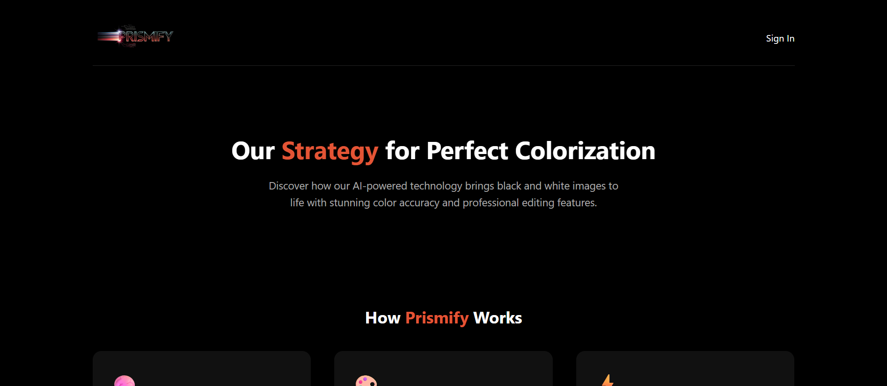
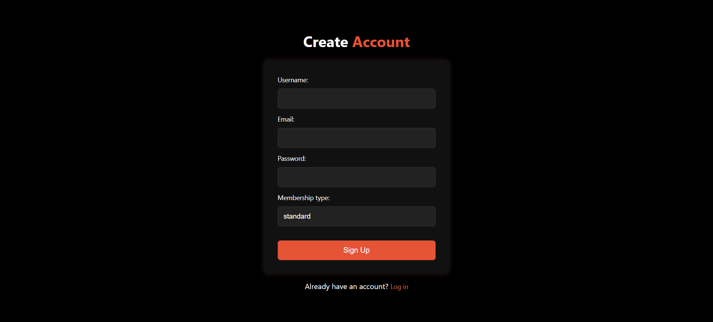
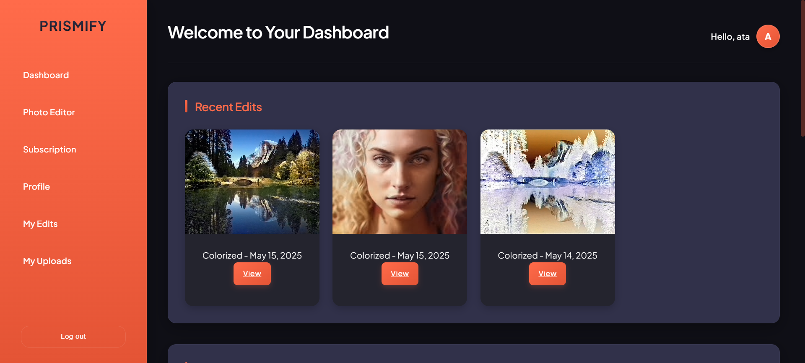
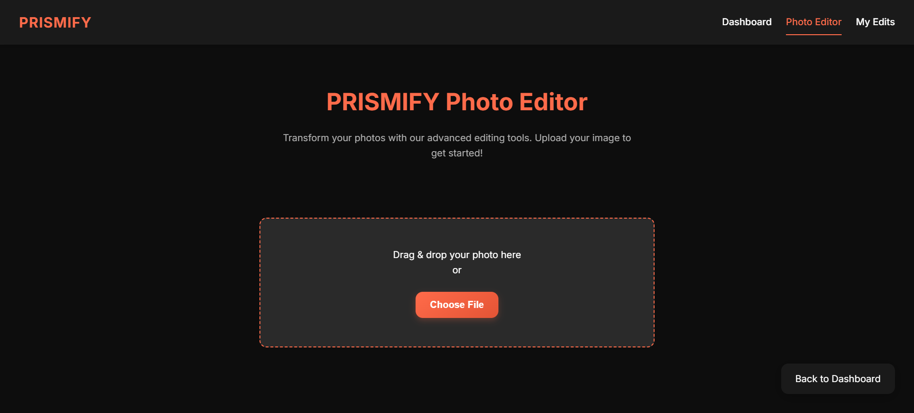
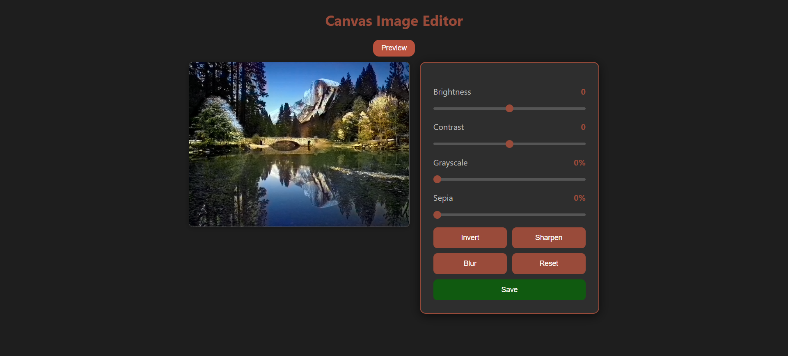
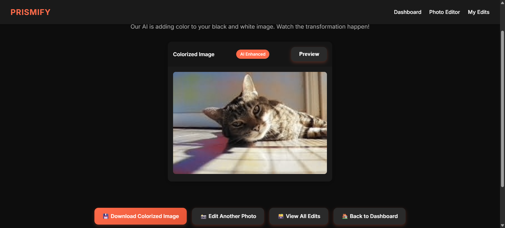

# Prismify – AI Image Colorizer

✨ **Prismify** is a modern web application that breathes life into black-and-white images using AI colorization. Beyond transforming photos with realistic colors, it offers advanced editing tools like contrast, blur, and saturation adjustments. Users can securely manage their images, compare results side-by-side, and keep a history of their creations—all from a sleek, responsive interface.

---

## Project Overview

The aim of Prismify is to simplify AI-driven image colorization for everyday users. Whether reviving old family photos or enhancing creative projects, Prismify provides a fast, intuitive solution. Users can upload grayscale images, instantly colorize them with an AI model, and fine-tune results with built-in editing tools—no technical expertise required.

---

## Screenshots
  

## Features

- **AI-Powered Colorization** – Transform black-and-white images into vivid color with a pre-trained AI model.
- **Advanced Editing Tools** – Adjust contrast, saturation, and blur for perfect results.
- **Before/After Comparison** – View original and colorized images.
- **User Authentication** – Sign up, log in, and manage personal accounts.
- **Image History & Gallery** – Access previously colorized and edited images.
- **Responsive Web Interface** – Smooth experience across devices.

---

## Problem Statement

Many users want to restore or creatively enhance old black-and-white photos but lack the technical skills or expensive software required for colorization and editing. **Prismify** provides a **centralized, user-friendly solution**, bringing AI colorization and image editing to everyone via an accessible web platform.

---

## Tech Stack

- **Backend:** Django
- **Frontend:** HTML, CSS, custom stylesheets
- **AI Model:** Pre-trained `colorization_release_v2.caffemodel` (Caffe framework)
- **Database:** SQLite

---

##  Installation & Setup

1. Clone the Repository
git clone https://github.com/ataur-rehman/AI-Image-Colorizer.git

     cd prismify

2. Install Dependencies
pip install -r requirements.txt

3. Apply Migrations
python manage.py migrate

4. Download the AI Model
Prismify uses the pre-trained Caffe model:

    Download:
    colorization_release_v2.caffemodel

    Place it in:
    prismify/image_app/colorizer/

5. Run the Development Server
python manage.py runserver
Then visit:

    http://127.0.0.1:8000/

---

**🌱 Future Enhancements**
Deployment to cloud platforms (e.g. Heroku, AWS)

1.Support for additional editing effects

2.Batch processing of multiple images

**🙌 Acknowledgements**

Colorization model by Richard Zhang et al.

Django community for powerful web tools

---

📬 Contact & Support

💼 GitHub: https://github.com/ataur-rehman
📩 Email: ataurrehman3636@gmail.com

⭐ If you like this project, consider giving it a star on GitHub! ⭐
